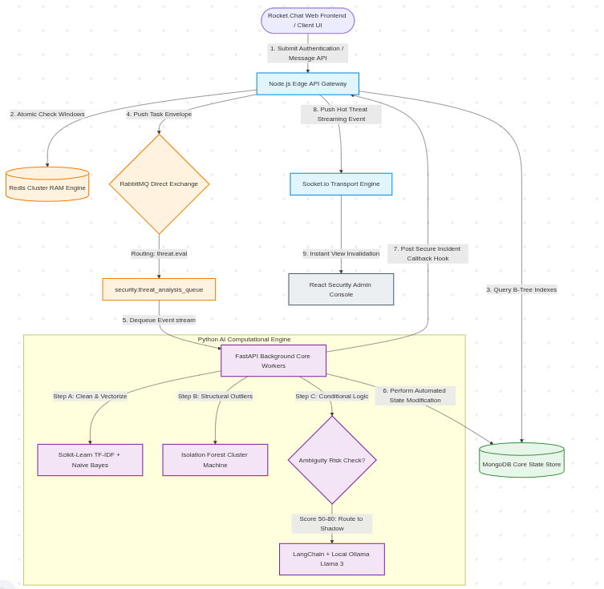
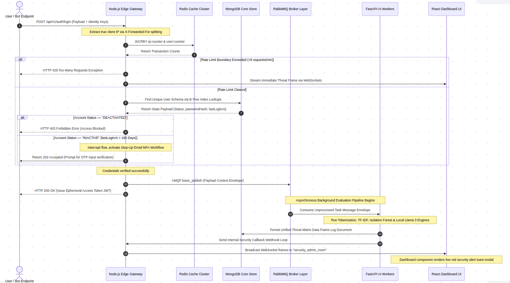

# 🛡️ TrustShield

### AI-powered Trust & Safety Platform

Enterprise-grade event-driven platform for authentication security, behavioral threat detection, and asynchronous AI-powered security analysis.

Built using **Node.js**, **FastAPI**, **RabbitMQ**, **Redis**, **MongoDB**, **React**, **Docker**, **Scikit-Learn**, and **Local Llama 3 (Ollama)**.

## 🚀 Live Production Demo

Experience the fully containerized TrustShield architecture live in action:
**[https://trustshield-pi.vercel.app/](https://trustshield-pi.vercel.app/)**

## 📌 Overview

Modern communication platforms primarily validate user credentials but rarely evaluate behavioral intent during authentication or messaging workflows.

TrustShield introduces an event-driven Trust & Safety architecture that separates real-time request validation from computationally expensive AI inference.

The platform performs synchronous edge validation while asynchronously executing machine learning and local large language model (LLM) analysis, enabling low-latency APIs without sacrificing advanced threat detection.

## 🛡️ Implemented Security Modules

TrustShield employs a multi-layered security approach, separating fast synchronous checks from deep asynchronous AI analysis.

### 1. Edge Gateway Security (Synchronous)
These modules execute in milliseconds during the active API request lifecycle.
- **Redis Sliding Window Rate Limiting**: Blocks high-frequency API abuse and brute-force attacks using precise time-windowed request tracking.
- **JWT Authentication Lifecycle**: Implements secure, short-lived access tokens paired with HTTP-only refresh tokens.
- **Account State Interception**: Instantly blocks requests from `DEACTIVATED` accounts and identifies `DORMANT` accounts (inactive for > 180 days) before granting access.
- **Step-up MFA Workflow**: Dynamically intercepts logins from dormant accounts and forces an Email OTP Multi-Factor Authentication challenge before issuing credentials.

### 2. Asynchronous Threat Detection Pipeline (Background)
These modules execute via RabbitMQ workers, ensuring heavy ML inference never blocks the end-user.
- **TF-IDF & Naive Bayes Classification**: High-speed Natural Language Processing (NLP) that instantly vectorizes and classifies text payloads for known spam and phishing vectors.
- **Isolation Forest Bot Detection**: Anomaly detection algorithm that flags automated bot behavior based on structural outliers in the user's request patterns.
- **Llama 3 Semantic Shadow Engine**: A localized Large Language Model (Ollama) that performs deep semantic reviews of borderline payloads to catch advanced social engineering and zero-day attacks.

### 3. Admin Security Operations (Real-Time)
- **WebSocket Transport Engine**: Pushes live threat event frames directly from the backend to the admin frontend without HTTP polling.
- **Live Security Dashboard**: Provides Trust & Safety teams with immediate visibility into flagged incidents, complete with AI confidence scores, categorical tags, and deterministic reasoning.
- **Dockerized Microservices**: Fully containerized environment ensuring environment parity and secure, isolated deployments across Gateway, AI Worker, and Frontend.

## 🏗️ System Architecture

> This diagram illustrates the high-level architecture of TrustShield, showing how requests flow across the Edge Gateway, asynchronous processing pipeline, AI inference workers, databases, and the real-time dashboard.

## ⚡ Why Event-Driven?

Traditional applications execute expensive AI inference inside the request-response lifecycle, increasing latency and reducing throughput.

TrustShield decouples heavy computation using RabbitMQ so that:

- Authentication remains responsive
- AI analysis executes asynchronously
- Workers scale independently
- WebSocket notifications remain real-time

## 🔄 Authentication & Threat Evaluation Flow

The following sequence diagram demonstrates how TrustShield processes authentication requests from initial gateway validation through asynchronous AI analysis and live dashboard notification.

## 🛠️ Technology Stack

| Layer | Technology |
|---------|------------|
| Edge Gateway | Node.js + TypeScript |
| Authentication | JWT |
| Cache | Redis |
| Database | MongoDB |
| Message Broker | RabbitMQ |
| AI Workers | FastAPI |
| Machine Learning | Scikit-Learn |
| LLM | Ollama + Llama 3 |
| Dashboard | React |
| Real-time Communication | Socket.io |
| Containerization | Docker |

## 📖 End-to-End Walkthrough Demo

Follow these steps to see how TrustShield's Event-Driven AI Pipeline analyzes user interactions and flags threats in real-time.

### Step 1: Log in as a User & Post Content
1. Go to the [Live Demo URL](https://trustshield-pi.vercel.app/).
2. Log in with a standard user account (or register a new one).
3. Navigate to the **Feed** or **Create Post** section.
4. Try posting a normal message (e.g., *"Hello world, excited to join this platform!"*).
5. Now, try posting a suspicious or malicious message simulating a phishing attack or spam (e.g., *"URGENT: Click this link to verify your bank account credentials immediately before your account gets permanently suspended!"*).

### Step 2: Log in as the Admin (Trust & Safety Team)
1. Open a new incognito window or log out of the user account.
2. Go to the Admin Login Portal: **[https://trustshield-pi.vercel.app/admin/login](https://trustshield-pi.vercel.app/admin/login)**
3. Log in using the seeded Admin credentials:
   - **Email:** `super_admin@trustshield.io`
   - **Password:** `securepassword123`

### Step 3: View Real-Time Threat Alerts
1. Upon logging into the Admin Security Console, navigate to the **Live Dashboard** or **Threats** tab.
2. You will instantly see the suspicious post you made earlier flagged as a threat in the system.
3. Click on the flagged alert to view the **Threat Details**. 
4. Observe how TrustShield's asynchronous AI workers (Isolation Forest & Llama 3) have automatically attached a confidence score, threat classification, and detailed reasoning for *why* the post was flagged—all executed in the background without slowing down the end-user's posting experience!
